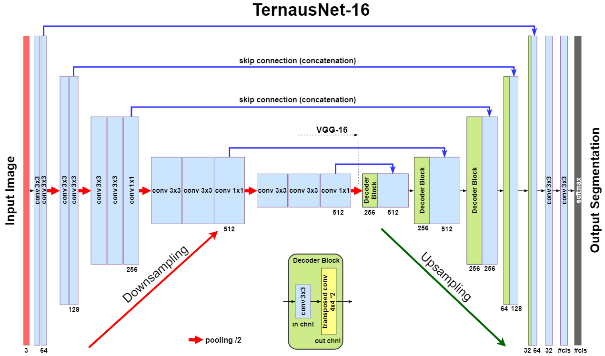
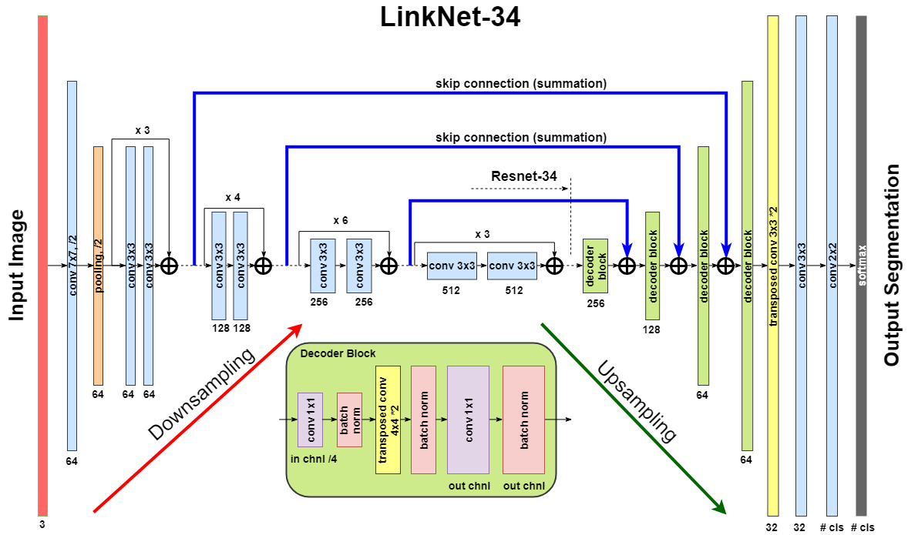
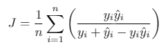
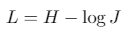
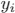
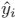
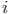

===========================================
MICCAI 2017 Robotic Instrument Segmentation
===========================================

Here we present our wining solution and its improvement for `MICCAI 2017 Robotic Instrument Segmentation Sub-Challenge`_.

In this work, we describe our winning solution for MICCAI 2017 Endoscopic Vision Sub-Challenge: Robotic Instrument Segmentation and demonstrate further improvement over that result. Our approach is originally based on U-Net network architecture that we improved using state-of-the-art semantic segmentation neural networks known as LinkNet and TernausNet. Our results shows superior performance for a binary  as well as for multi-class robotic instrument segmentation. We believe that our methods can lay a good foundation for the tracking and pose estimation in the vicinity of surgical scenes.

.. contents::

Team members
------------
`Alexey Shvets`_, `Alexander Rakhlin`_, `Alexandr A. Kalinin`_, `Vladimir Iglovikov`_

Citation
----------

If you find this work useful for your publications, please consider citing::

    @inproceedings{shvets2018automatic,
    title={Automatic Instrument Segmentation in Robot-Assisted Surgery using Deep Learning},
    author={Shvets, Alexey A and Rakhlin, Alexander and Kalinin, Alexandr A and Iglovikov, Vladimir I}},
    booktitle={2018 17th IEEE International Conference on Machine Learning and Applications (ICMLA)},
    pages={624--628},
    year={2018}
    }

Overview
--------
Semantic segmentation of robotic instruments is an important problem for the robot-assisted surgery. One of the main challenges is to correctly detect an instrument's position for the tracking and pose estimation in the vicinity of surgical scenes. Accurate pixel-wise instrument segmentation is needed to address this challenge. Our approach demonstrates an improvement over the state-of-the-art results using several novel deep neural network architectures. It addressed the binary segmentation problem, where every pixel in an image is labeled as an instrument or background from the surgery video feed. In addition, we solve a multi-class segmentation problem, in which we distinguish between different instruments or different parts of an instrument from the background. In this setting, our approach outperforms other methods in every task subcategory for automatic instrument segmentation thereby providing state-of-the-art results for these problems.

Data
----
The training dataset consists of 8 |times| 225-frame sequences of high resolution stereo camera images acquired from a `da Vinci Xi surgical system`_ during several different porcine procedures. Training sequences are provided with 2 Hz frame rate to avoid redundancy. Every video sequence consists of two stereo channels taken from left and right cameras and has a 1920 |times| 1080 pixel resolution in RGB format. The articulated parts of the robotic surgical instruments, such as a rigid shaft, an articulated wrist and claspers have been hand labelled in each frame. Furthermore, there are instrument type labels that categorize instruments in following categories: left/right prograsp forceps, monopolar curved scissors, large needle driver, and a miscellaneous category for any other surgical instruments.

.. class:: center

    |gif1| |gif2|
    |br|
    |gif3| |gif4|
    |br|
    Original sequence (top left). Binary segmentation, 2-class (top right). Parts, 3-class (bottom left). Instruments, 7-class (bottom right)

Method
------
We evaluate 4 different deep architectures for segmentation: `U-Net`_, 2 modifications of `TernausNet`_, and a modification of `LinkNet`_. The output of the model is a pixel-by-pixel mask that shows the class of each pixel. Our winning submission to the MICCAI 2017 Endoscopic Vision Sub-Challenge uses slightly modified version of the original U-Net model.

As an improvement over U-Net, we use similar networks with pre-trained encoders. TernausNet is a U-Net-like architecture that uses relatively simple pre-trained VGG11 or VGG16 networks as an encoder:

|br|
|br|

LinkNet model uses an encoder based on a ResNet-type architecture. In this work, we use pre-trained ResNet34. The decoder of the network consists of several decoder blocks that are connected with the corresponding encoder block. Each decoder block includes 1 |times| 1 convolution operation that reduces the number of filters by 4, followed by batch normalization and transposed convolution to upsample the feature map:

Training
--------

We use Jaccard index (Intersection Over Union) as the evaluation metric. It can be interpreted as a similarity measure between a finite number of sets. For two sets A and B, it can be defined as following:

.. raw:: html

    <figure>
        
    </figure>

Since an image consists of pixels, the expression can be adapted for discrete objects in the following way:

where |y| and |y_hat| are a binary value (label) and a predicted probability for the pixel |i|, respectively.

Since image segmentation task can also be considered as a pixel classification problem, we additionally use common classification loss functions, denoted as H. For a binary segmentation problem H is a binary cross entropy, while for a multi-class segmentation problem H is a categorical cross entropy.

As an output of a model, we obtain an image, where every pixel value corresponds to a probability of belonging to the area of interest or a class. The size of the output image matches the input image size. For binary segmentation, we use 0.3 as a threshold value (chosen using validation dataset) to binarize pixel probabilities. All pixel values below the specified threshold are set to 0, while all values above the threshold are set to 255 to produce final prediction mask. For multi-class segmentation we use similar procedure, but we assign different integer numbers for each class.

Results
-------

For binary segmentation the best results is achieved by TernausNet-16 with IoU=0.836 and Dice=0.901. These are the best values reported in the literature up to now (`Pakhomov`_, `Garcia`_). Next, we consider multi-class segmentation of different parts of instruments. As before, the best results reveals TernausNet-16 with IoU=0.655 and Dice=0.760. For the multi-class instrument segmentation task the results look less optimistic. In this case the best model is TernausNet-11 with IoU=0.346 and Dice=0.459 for 7 class segmentation. Lower performance can be explained by the relatively small dataset size. There are 7 instrument classes and some of them appear just few times in the training dataset. Nevertheless, in the competition we achieved the best performance in this sub-category too.

.. raw:: html

    <figure>
        
        <figcaption>Comparison between several architectures for binary and multi-class segmentation.</figcaption>
    </figure>
|
|
|

.. table:: Segmentation results per task. Intersection over Union, Dice coefficient and inference time, ms.

    ============= ========= ========= ========= ========= ========= ====== ========= ========= =======
    Task:         Binary segmentation           Parts segmentation         Instrument segmentation
    ------------- ----------------------------- -------------------------- ---------------------------
    Model         IOU, %    Dice, %   Time      IOU, %    Dice, %   Time     IOU, %  Dice, %   Time
    ============= ========= ========= ========= ========= ========= ====== ========= ========= =======
    U-Net         75.44     84.37     93.00     48.41     60.75     106    15.80     23.59     **122**
    TernausNet-11 81.14     88.07     142.00    62.23     74.25     157    **34.61** **45.86** 173
    TernausNet-16 **83.60** **90.01** 184.00    **65.50** **75.97** 202    33.78     44.95     275
    LinkNet-34    82.36     88.87     **88.00** 34.55     41.26     **97** 22.47     24.71     177
    ============= ========= ========= ========= ========= ========= ====== ========= ========= =======

Pre-trained weights for all model of all segmentation tasks can be found at `google drive`_

Dependencies
------------

* Python 3.6
* PyTorch 0.4.0
* TorchVision 0.2.1
* numpy 1.14.0
* opencv-python 3.3.0.10
* tqdm 4.19.4

To install all these dependencies you can run
::
    pip install -r requirements.txt

How to run
----------

The dataset is organized in the folloing way:

::

    ├── data
    │   ├── cropped_train
    │   ├── models
    │   ├── test
    │   │   ├── instrument_dataset_1
    │   │   │   ├── left_frames
    │   │   │   └── right_frames
    |   |   ....................... 
    │   └── train
    │       ├── instrument_dataset_1
    │       │   ├── ground_truth
    │       │   │   ├── Left_Prograsp_Forceps_labels
    │       │   │   ├── Maryland_Bipolar_Forceps_labels
    │       │   │   ├── Other_labels
    │       │   │   └── Right_Prograsp_Forceps_labels
    │       │   ├── left_frames
    │       │   └── right_frames
    │       .......................

The training dataset contains only 8 videos with 255 frames each. Inside each video all frames are correlated, so, for 4-fold cross validation of our experiments, we split data using this dependance i.e utilize whole video for the validation. In such a case, we try to make every fold to contain more or less equal number of instruments. The test dataset consists of 8x75-frame sequences containing footage sampled immediately after each training sequence and 2 full 300-frame sequences, sampled at the same rate as the training set. Under the terms of the challenge, participants should exclude the corresponding training set when evaluating on one of the 75-frame sequences. 

1. Preprocessing
~~~~~~~~~~~~~~~~~~~~~~
As a preprocessing step we cropped black unindormative border from all frames with a file ``prepare_data.py`` that creates folder ``data/cropped_train.py`` with masks and images of the smaller size that are used for training. Then, to split the dataset for 4-fold cross-validation one can use the file: ``prepare_train_val``.

2. Training
~~~~~~~~~~~~~~~~~~~~~~
The main file that is used to train all models -  ``train.py``.

Running ``python train.py --help`` will return set of all possible input parameters.

To train all models we used the folloing bash script :

::

    #!/bin/bash

    for i in 0 1 2 3
    do
       python train.py --device-ids 0,1,2,3 --batch-size 16 --fold $i --workers 12 --lr 0.0001 --n-epochs 10 --type binary --jaccard-weight 1
       python train.py --device-ids 0,1,2,3 --batch-size 16 --fold $i --workers 12 --lr 0.00001 --n-epochs 20 --type binary --jaccard-weight 1
    done

3. Mask generation
~~~~~~~~~~~~~~~~~~~~~~
The main file to generate masks is ``generate_masks.py``.

Running ``python generate_masks.py --help`` will return set of all possible input parameters.

Example:
:: 
    python generate_masks.py --output_path predictions/unet16/binary --model_type UNet16 --problem_type binary --model_path data/models/unet16_binary_20 --fold -1 --batch-size 4

4. Evaluation
~~~~~~~~~~~~~~~~~~~~~~
The evaluation is different for a binary and multi-class segmentation: 

[a] In the case of binary segmentation it calculates jaccard (dice) per image / per video and then the predictions are avaraged. 

[b] In the case of multi-class segmentation it calculates jaccard (dice) for every class independently then avaraged them for each image and then for every video
::

    python evaluate.py --target_path predictions/unet16 --problem_type binary --train_path data/cropped_train

5. Further Improvements
~~~~~~~~~~~~~~~~~~~~~~

Our results can be improved further by few percentages using simple rules such as additional augmentation of train images and train the model for longer time. In addition, the cyclic learning rate or cosine annealing could be also applied. To do it one can use our pre-trained weights as initialization. To improve test prediction TTA technique could be used as well as averaging prediction from all folds.

6. Demo Example
~~~~~~~~~~~~~~~~~~~~~~
You can easily start working with our models using the demonstration example
  `Demo.ipynb`_

..  _`Demo.ipynb`: https://github.com/ternaus/robot-surgery-segmentation/blob/master/Demo.ipynb
.. _`Alexander Rakhlin`: https://www.linkedin.com/in/alrakhlin/
.. _`Alexey Shvets`: https://www.linkedin.com/in/shvetsiya/
.. _`Vladimir Iglovikov`: https://www.linkedin.com/in/iglovikov/
.. _`Alexandr A. Kalinin`: https://alxndrkalinin.github.io/
.. _`MICCAI 2017 Robotic Instrument Segmentation Sub-Challenge`: https://endovissub2017-roboticinstrumentsegmentation.grand-challenge.org/
.. _`da Vinci Xi surgical system`: https://intuitivesurgical.com/products/da-vinci-xi/
.. _`TernausNet`: https://arxiv.org/abs/1801.05746
.. _`U-Net`: https://arxiv.org/abs/1505.04597
.. _`LinkNet`: https://arxiv.org/abs/1707.03718
.. _`Garcia`: https://arxiv.org/abs/1706.08126
.. _`Pakhomov`: https://arxiv.org/abs/1703.08580
.. _`google drive`: https://drive.google.com/open?id=13e0C4fAtJemjewYqxPtQHO6Xggk7lsKe

.. |br| raw:: html

    

.. |plusmn| raw:: html

   &plusmn

.. |times| raw:: html

   &times

.. |micro| raw:: html

   &microm

.. |gif1| image:: images/original-min.gif
.. |gif2| image:: images/binary-min.gif
.. |gif3| image:: images/parts-min.gif
.. |gif4| image:: images/types-min.gif

